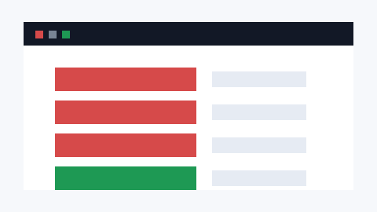
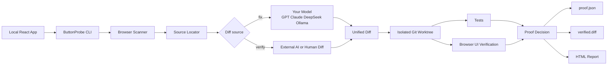
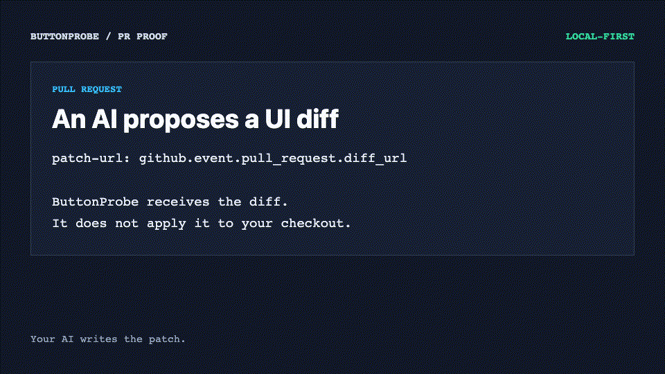

# ButtonProbe

> ButtonProbe verifies whether a UI repair actually works before it touches your repo.

Find dead buttons. Get verified patches. Keep your repo untouched.



```bash
npx buttonprobe fix http://localhost:5173 \
  --test-command "npm test" \
  --dev-command "npm run dev -- --host 127.0.0.1 --port {port}"
```

```bash
npx buttonprobe verify http://localhost:5173 \
  --patch agent.diff \
  --test-command "npm test" \
  --dev-command "npm run dev -- --host 127.0.0.1 --port {port}" \
  --browser chromium,firefox,webkit
```

<!-- benchmark:start -->
**5/5 viral cases passing. 9/10 React cases UI-verified. 1/1 external third-party cases UI-verified. Original repo pollution rate: 0.**

| Suite | Result | Source Top-1 | Residue | Evidence date |
| --- | --- | --- | --- | --- |
| Viral | 5/5 passing | 1 | 0 | 2026-08-19 |
| React | 9/10 UI-verified | 1 | 0 | 2026-08-19 |
| External | 1/1 UI-verified | 1 | 0 | 2026-08-20 |

Generated from real local eval artifacts in `benchmarks/latest.json`.
<!-- benchmark:end -->

ButtonProbe is a local-first proof layer for UI repair diffs. It clicks controls in your local app, finds inert or crashing buttons, optionally asks your own model for a unified diff, then proves the diff in an isolated Git worktree with tests, browser evidence, screenshots, and a report.

It is not trying to be a general AI coding agent. The sharp use case is simpler and harder to fake:

- Is this button actually broken?
- Did this patch actually fix it?
- Did it break another working button on the page?
- Can I inspect the exact diff before my checkout is touched?

## Architecture



## Why People Star It

- **Works with your AI stack:** GPT, Claude, DeepSeek, OpenRouter-compatible endpoints, or local Ollama.
- **Zero-model deterministic repair:** common dead-button patterns are fixed by built-in templates with **0 model calls** and 0 API cost, then proven through the same worktree + browser gate.
- **No backend:** no hosted model proxy, no telemetry, no database.
- **Safe by default:** repair runs in a detached Git worktree and keeps your current checkout clean.
- **Verifies other agents:** `verify --patch` checks diffs from Claude, Codex, Cursor, or a human reviewer with **0 model calls**.
- **MCP server for agents:** `buttonprobe mcp` exposes scan / verify / doctor tools to Claude Code, Cursor, and Codex so any agent can prove its UI patch before merge.
- **Proof-carrying output:** `verified.diff`, `proof.json`, before/after screenshots, test logs, source candidates, and `report.html`.
- **Narrow on purpose:** React/Vite dead-button repair first; broader scanning still works for local web apps.

## 10 Second Demo

Run the zero-cost public eval. Two repairs come from built-in deterministic templates with zero model calls; the rest use the packaged mock OpenAI-compatible endpoint. You do not need an API key.

```bash
npx playwright install chromium
npx buttonprobe eval viral
```

Expected result:

```text
ButtonProbe viral eval: 5/5 passed.
Original repo pollution rate: 0
```

## What It Can Fix Today

ButtonProbe’s automatic repair loop currently targets local React JavaScript/TypeScript apps with broken click handlers and inert controls.

| Case | Evidence |
| --- | --- |
| empty `onClick` | UI-verified, deterministic template, 0 model calls |
| wrong state update | UI-verified |
| missing route navigation | UI-verified, deterministic template, 0 model calls |
| stale closure state update | UI-verified |
| wrong setter target | UI-verified |
| disabled submit handler | UI-verified |
| missing callback prop wiring | UI-verified |
| modal never opens | UI-verified |
| normal button regression guard | preserved |

Run the benchmarks:

```bash
npx buttonprobe eval viral
npx buttonprobe eval react
```

The React suite runs 10 isolated Git fixtures. Nine repairs reach `ui-verified` (two of them with zero model calls), one intentionally fails UI verification, and one working control is preserved. Every case writes its own artifact directory with screenshots, test log, source candidate, diff, failure stage, pollution result, and residue list.

## Zero-Model Deterministic Repair

Some dead-button patterns are unambiguous, so ButtonProbe repairs them without calling any model:

| Template | Fires when | Generates |
| --- | --- | --- |
| `empty-onclick-setter` | empty `onClick`, strong identity, resolved event chain, exactly one `useState` setter, and a scenario with exactly one `text` expectation | `onClick={() => setX("<expected text>")}` |
| `missing-route-navigation` | empty `onClick`, strong identity, resolved event chain, and a scenario `urlIncludes` expectation with an absolute path | `onClick={() => navigate("<path>")}` when the file already uses `useNavigate`, otherwise `onClick={() => window.history.pushState({}, "", "<path>")}` |

Rules are deliberately strict:

- Template patches run through the exact same gate as model patches: patch validation, isolated worktree tests, browser UI verification, scenario checks, and same-page regression protection.
- A template that fails verification escalates to your model when one is configured; otherwise the run is blocked with an explicit reason.
- Without any scenario evidence, no template fires. ButtonProbe never guesses.
- `buttonprobe fix` works with no model configured at all when a template matches; the report and eval record `patchSource: template` and `modelCalls: 0`.

## MCP Server

`buttonprobe mcp` starts a Model Context Protocol stdio server with three tools. All of them make **zero model calls**:

| Tool | Purpose |
| --- | --- |
| `buttonprobe_scan` | Click every control and report dead buttons |
| `buttonprobe_verify` | Prove an external diff (Claude, Codex, Cursor, human) in an isolated worktree |
| `buttonprobe_doctor` | Readiness checks with actionable fixes |

Claude Code:

```bash
claude mcp add buttonprobe -- npx buttonprobe mcp
```

Cursor (`.cursor/mcp.json`):

```json
{
  "mcpServers": {
    "buttonprobe": {
      "command": "npx",
      "args": ["buttonprobe", "mcp"]
    }
  }
}
```

Codex (`~/.codex/config.toml`):

```toml
[mcp_servers.buttonprobe]
command = "npx"
args = ["buttonprobe", "mcp"]
```

Let your agent write the patch, then ask it to call `buttonprobe_verify` before merge. The tool returns the proof status plus absolute paths to `proof.json`, `report.html`, and `verified.diff`, and it never applies a patch unless you pass `apply: true` and the patch reached `ui-verified`.

## GitHub Action

Use ButtonProbe as a required PR check when another AI, an IDE agent, or a contributor has proposed a UI diff. The Action runs `verify` only: it never calls a model and never applies a patch to the runner checkout.



```yaml
- uses: shidesheng0218/buttonprobe@v0
  with:
    url: http://127.0.0.1:5173
    patch-url: ${{ github.event.pull_request.diff_url }}
    test-command: npm test
    dev-command: npm run dev -- --host 127.0.0.1 --port {port}
```

It exposes `status`, `proof-path`, `report-path`, `verified-diff-path`, `model-calls`, and `original-checkout-modified`. Upload the proof directory with `actions/upload-artifact`; a complete workflow is in [examples/buttonprobe-verify-pr.yml](examples/buttonprobe-verify-pr.yml).

## Verify Any Patch

This is the moat: ButtonProbe can verify a patch from any AI or human without asking a model for anything.

```bash
npx buttonprobe verify http://localhost:5173 \
  --patch agent.diff \
  --test-command "npm test" \
  --dev-command "npm run dev -- --host 127.0.0.1 --port {port}"
```

Verify a GitHub pull request diff without asking any model:

```bash
npx buttonprobe verify http://localhost:5173 \
  --patch-url "https://github.com/owner/repo/pull/123.diff" \
  --target "[data-testid='save-profile']" \
  --test-command "npm test" \
  --dev-command "npm run dev -- --host 127.0.0.1 --port {port}"
```

Status levels:

| Status | Meaning |
| --- | --- |
| `patch-generated` | a diff exists but has not been proven |
| `patch-applies` | the diff applies in an isolated worktree |
| `test-verified` | tests pass in the patched worktree |
| `ui-verified` | tests pass, the target works in browser evidence, and no same-page regression was found |
| `rejected` | patch failed tests, UI verification, scenario checks, or regression protection |

`--apply` only applies a diff after it reaches `ui-verified`.

When more than one browser is requested, every requested browser must pass the target interaction, scenario checks, and same-page regression guard. A missing browser binary or a failed browser run leaves the patch at `test-verified`; it never upgrades the result by report metadata alone.

## External Eval

External benchmarks are opt-in because they clone public repositories and run only the manifest commands you provide. Every case must pin a Git commit, declare its framework, license, expected source file, and provide a local `patchFile`, `testCommand`, and `devCommand`.

```bash
buttonprobe eval external \
  --manifest fixtures/external-react/manifest.json \
  --allow-network
```

The command exits non-zero unless every case reaches `ui-verified`. Results retain a per-case proof, report, verified diff, and cleanup result under the requested output directory.

The manifest includes a pinned third-party React/Vite case from `bitovi/trainings`. Reproduce that case alone while iterating on the benchmark:

```bash
buttonprobe eval external \
  --manifest fixtures/external-react/manifest.json \
  --allow-network \
  --case bitovi/trainings-use-toggle
```

## Why This Is Safe

- The model only returns JSON and unified diffs; it never runs shell commands.
- `scan` and `verify --patch` do not call a model.
- The default repair path writes to a temporary detached Git worktree.
- The patched worktree reuses your local `node_modules`; ButtonProbe does not install dependencies.
- Dirty worktrees degrade to patch-only behavior.
- The default `observe` network mode blocks clicked `POST`, `PUT`, `PATCH`, and `DELETE` requests.
- API keys stay in environment variables and are never written to config or reports.
- Source snippets and DOM evidence are redacted before model calls.

ButtonProbe does **not** repair backend code, database migrations, payments, deletions, permissions, production hosts, or real external API workflows.

## BYOK Setup

OpenAI-compatible endpoint:

```bash
export BUTTONPROBE_BASE_URL=https://api.openai.com/v1
export BUTTONPROBE_API_KEY=your-openai-key
export BUTTONPROBE_MODEL=gpt-4.1-mini
```

Anthropic Claude:

```bash
export BUTTONPROBE_PROVIDER=anthropic
export BUTTONPROBE_BASE_URL=https://api.anthropic.com
export ANTHROPIC_API_KEY=your-anthropic-key
export BUTTONPROBE_MODEL=claude-sonnet-5
```

DeepSeek:

```bash
export BUTTONPROBE_BASE_URL=https://api.deepseek.com
export BUTTONPROBE_API_KEY=your-deepseek-key
export BUTTONPROBE_MODEL=deepseek-chat
```

Ollama:

```bash
export BUTTONPROBE_BASE_URL=http://localhost:11434/v1
export BUTTONPROBE_MODEL=your-local-model
```

Provider recipes: [docs/providers.md](docs/providers.md).

## Scenario Contracts

Use scenario contracts when a DOM change is not enough proof. Scenarios are deterministic checks; the model does not decide whether they pass.

```json
{
  "scenarios": {
    "save-profile": {
      "route": "/profile",
      "target": "[data-testid='save-profile']",
      "actions": [
        { "type": "click", "selector": "[data-testid='save-profile']" }
      ],
      "expect": [
        { "type": "text", "value": "Saved" },
        { "type": "visible", "selector": "[data-testid='save-toast']" },
        { "type": "urlIncludes", "value": "/profile" }
      ],
      "forbid": [
        { "type": "text", "value": "Error" },
        { "type": "consoleError" },
        { "type": "urlIncludes", "value": "/login" }
      ]
    }
  }
}
```

Legacy `behaviorContracts` still work and are internally converted to single-click scenarios.

## Source Mapping

For Vite apps, add the development-only source anchor plugin:

```ts
import { defineConfig } from "vite";
import { createButtonProbeVitePlugin } from "buttonprobe/vite";

export default defineConfig({
  plugins: [createButtonProbeVitePlugin()]
});
```

ButtonProbe writes `.buttonprobe/source-manifest.json` and maps controls back to source files. Without instrumentation, it falls back to JSX-aware matching with `data-testid`, visible text, ARIA labels, handlers, state setters, router calls, callback props, custom hooks, and import context. Low-confidence locations stay patch-only.

## CLI

```bash
npx buttonprobe scan http://localhost:5173
npx buttonprobe analyze http://localhost:5173
npx buttonprobe fix http://localhost:5173 --test-command "npm test"
npx buttonprobe verify http://localhost:5173 --patch agent.diff --test-command "npm test" --dev-command "npm run dev -- --port {port}"
npx buttonprobe verify http://localhost:5173 --patch-url "https://github.com/owner/repo/pull/123.diff" --target "[data-testid='save']" --test-command "npm test" --dev-command "npm run dev -- --port {port}"
npx buttonprobe eval viral
npx buttonprobe eval react
npx buttonprobe doctor http://localhost:5173 --test-command "npm test"
npx buttonprobe init --url http://localhost:5173 --test-command "npm test"
npx buttonprobe mcp
```

Use `--no-images` to reduce model input cost.

## Output

```text
.buttonprobe/
  report.html
  scan.json
  repairs.json
  proof.json
  verified.diff
  eval/viral/eval-results.json
  patches/
  repairs/
  screenshots/
  cache/
```

The report includes verdicts, AI assessments, source candidates, repair timeline, accepted/rejected diffs, tests, UI verification, scenario failures, regressions, model usage, cost estimate, and loop stop reasons.

## Scope

Supported well today:

- Localhost development apps
- React JavaScript/TypeScript automatic repair
- Vite-first workflows
- Dead buttons, inert controls, broken click handlers
- BYOK model repair
- External patch verification

Deferred:

- Production sites
- Login-heavy apps without local Playwright storage state
- Backend business logic
- Database changes
- Payment, deletion, permission, and destructive flows
- Vue/Svelte/Next.js automatic repair until each framework has public UI-verified eval evidence

## Launch Story

> I built a CLI that clicks every button in your React app and asks AI to repair the dead ones safely.

The important part is not that AI writes a patch. The important part is that ButtonProbe proves whether the patch works before it touches your repo.

Roadmap: [ROADMAP.md](./ROADMAP.md)  
Implementation notes: [IMPLEMENTATION_PLAN.md](./IMPLEMENTATION_PLAN.md)
